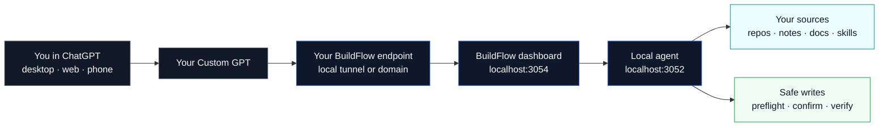
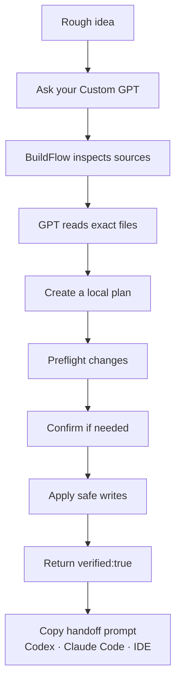

# BuildFlow

**BuildFlow is a free, self-hosted dashboard that connects ChatGPT Custom GPTs to your local repos, notes, docs, and planning files.**

Use the ChatGPT interface you already know, add one or more local sources as context, then let your Custom GPT inspect, search, read, plan, and safely write back to your repo with verified file operations.

BuildFlow is built for people who want high-quality AI reasoning over real project context without turning every request into separate API spend.



## Why use BuildFlow?

BuildFlow gives your Custom GPT a practical local workspace.

Instead of copying files into chat manually, you connect your repo once and let your GPT ask BuildFlow for the exact context it needs.

### The big benefits

- **Use ChatGPT’s reasoning models inside your ChatGPT plan**
  BuildFlow works through Custom GPT actions. You can use ChatGPT reasoning over your local projects without making every request a separate OpenAI API call. ChatGPT usage still follows your plan limits, but BuildFlow itself does not add API usage charges.

- **Bring one or multiple repos into context**
  Add sources, index them locally, choose active context, and let the GPT inspect, search, and read real files instead of guessing.

- **Code from ChatGPT, safely**
  BuildFlow can apply allowed file changes with policy checks, dry runs, confirmations, and `verified:true` write results.

- **Use the interface you already know**
  The main interaction happens in ChatGPT. That means less learning curve, less setup friction, and a familiar place for reasoning, planning, and follow-up questions.

- **Work from desktop, web, or phone**
  Because the Custom GPT lives in ChatGPT, you can review, plan, and trigger BuildFlow actions from anywhere you can use ChatGPT, as long as your BuildFlow endpoint is reachable.

- **Keep project memory and conversations together**
  You can keep chats, apps, plans, and follow-ups organized in ChatGPT folders while BuildFlow keeps the repo-side context grounded in your local files.

- **Use Codex CLI, Claude Code, or your IDE when needed**
  BuildFlow generates handoff prompts from the current source state, active context, local plan, and recent activity so you can move work into coding tools cleanly.

## What BuildFlow can do today

BuildFlow Local includes:

- local dashboard on `http://127.0.0.1:3054/dashboard`
- local agent on `http://127.0.0.1:3052`
- source management for repos, notes, docs, and other local folders
- local indexing and search
- active source context selection
- safe write mode controls
- dry-run / preflight write checks
- confirmation-gated writes for sensitive paths
- verified file operations with `verified:true`
- activity feedback for Custom GPT actions
- dashboard activity feed
- local plan and task workflow
- local plan import/export
- dynamic handoff prompts for Codex and Claude Code
- first-run setup checklist
- user-owned Custom GPT OpenAPI endpoint setup

## Quick start

BuildFlow Local runs on your machine.

```bash
pnpm install
pnpm local:restart
```

Then open:

```text
http://127.0.0.1:3054/dashboard
```

The dashboard will guide you through the first-run checklist:

1. confirm the local agent is running
2. copy your OpenAPI endpoint
3. add a local source
4. wait for indexing
5. choose active context
6. review write mode
7. create a local plan
8. open Handoff

## Connect a Custom GPT

In the Custom GPT editor, import the BuildFlow action schema from your own endpoint.

Use one of these:

```text
Local reference file:
docs/openapi.chatgpt.json

Local running endpoint:
http://127.0.0.1:3054/api/openapi

Endpoint for a Custom GPT:
https://<your-domain-or-tunnel>/api/openapi
```

Use your own tunnel, reverse proxy, or domain. The public GitHub version is self-hosted; your Custom GPT should call an endpoint you control.

Then add the instructions from:

```text
docs/CUSTOM_GPT_INSTRUCTIONS.md
```

After changing the schema, re-import the action definition in the GPT editor and start a new chat so ChatGPT uses the updated actions.

## How the workflow feels



A typical flow:

1. Ask your Custom GPT what to build next.
2. BuildFlow inspects your repo and reads the relevant files.
3. The GPT creates a plan or execution packet.
4. You review the plan in the dashboard.
5. BuildFlow preflights file changes before writing.
6. You confirm sensitive writes when required.
7. BuildFlow verifies the result on disk.
8. You continue in ChatGPT, Codex CLI, Claude Code, or your IDE.

## Safety model

BuildFlow is designed to be useful without being permissive.

The write policy blocks or protects risky paths and patterns, including:

- `.env` and `.env.*`
- private keys and credential-like files
- path traversal and absolute paths outside the source root
- `.git/**`
- `node_modules/**`
- `.next/**`
- `dist/**`
- `build/**`
- `coverage/**`

Sensitive operations require confirmation when appropriate, including dependency files, workflows, delete/move/rename operations, and protected paths.

BuildFlow only treats a write as successful when the result includes:

```json
{ "verified": true }
```

## Custom GPT actions

The Custom GPT action surface is intentionally small:

- `getBuildFlowStatus`
- `listBuildFlowSources`
- `getBuildFlowActiveContext`
- `setBuildFlowActiveContext`
- `inspectBuildFlowContext`
- `readBuildFlowContext`
- `writeBuildFlowArtifact`
- `applyBuildFlowFileChange`

These actions let ChatGPT check status, inspect sources, read files, create planning artifacts, and safely apply policy-checked file changes.

## What BuildFlow is not

BuildFlow Local is not a replacement for your IDE, git client, test runner, or coding agent.

It is the local context and safety layer between ChatGPT and your workspace.

Use it to reason, plan, inspect, read, preflight, write small safe changes, and prepare clean handoffs.

## Product docs

Useful docs:

- [`docs/product/README.md`](docs/product/README.md) — product index
- [`docs/product/public-scope.md`](docs/product/public-scope.md) — public BuildFlow Local scope
- [`docs/product/local/feature-scope.md`](docs/product/local/feature-scope.md) — Local feature scope
- [`docs/openapi.chatgpt/README.md`](docs/openapi.chatgpt/README.md) — Custom GPT action import guide
- [`docs/CUSTOM_GPT_INSTRUCTIONS.md`](docs/CUSTOM_GPT_INSTRUCTIONS.md) — GPT instructions

## Contributing

BuildFlow is free, self-hosted, and open-source.

If it helps you build with ChatGPT and your local repos, please star the repo, try it on a real project, and share feedback.

```text
github.com/stevewesthoek/buildflow
```
